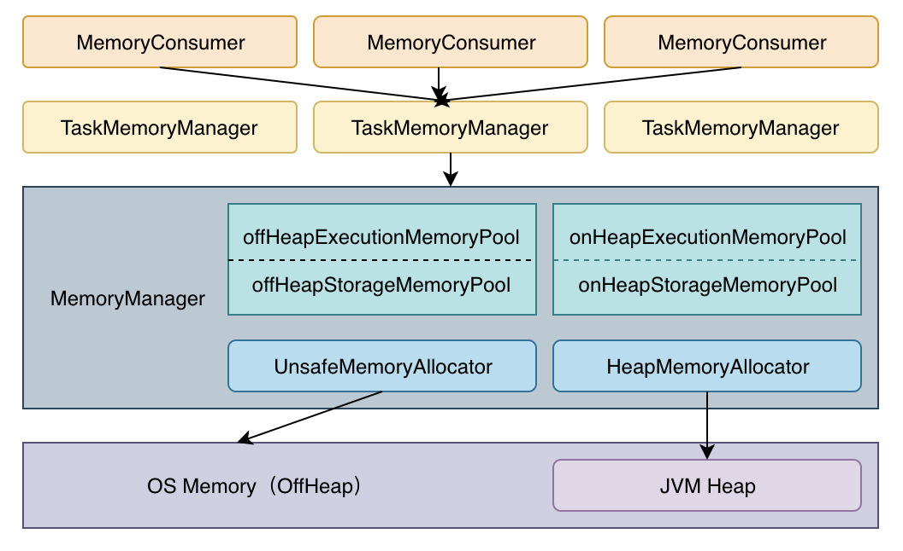

# Execution

## Spark Execution Memory

## Task

Task是Spark作业运行最小单元。

- TaskContext -> TaskContextImpl
- ShuffleBlockResolver -> IndexShuffleBlockResolver
- ShuffleMapTask
- ResultTask

## Reference